<p align="center">
  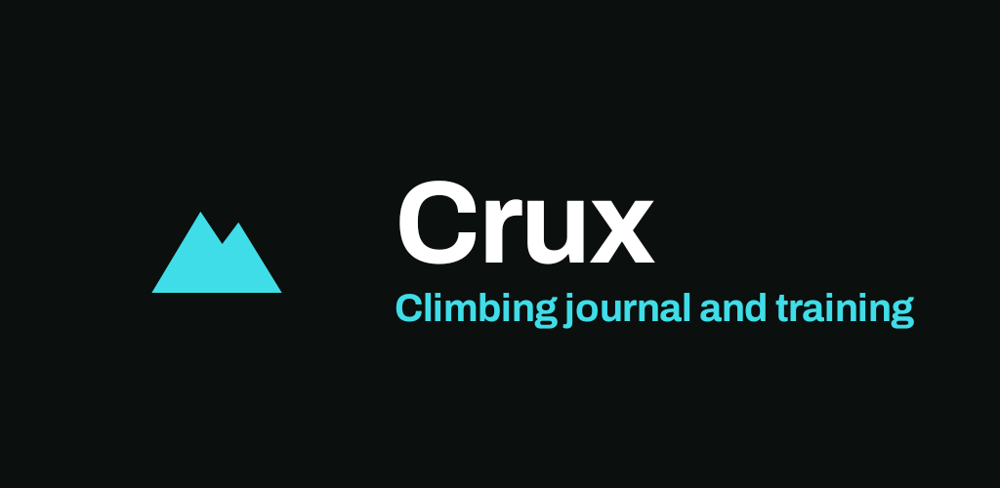
</p>

<p align="center">
  <a href="https://github.com/hardtekpt/crux/releases/latest"></a>
  <a href="https://github.com/hardtekpt/crux/actions/workflows/ci.yml"></a>
  
  <a href="LICENSE"></a>
</p>

**Crux** is a free, open-source Android app for climbers. Plan your training and run it live, keep a
journal of every climb at the places you climb, and watch your progress. No account, no ads, no
tracking: your data stays on your phone.

**[Download the latest release](https://github.com/hardtekpt/crux/releases/latest)** ·
**[User guide](docs/user/getting-started.md)** · **[Developer guide](docs/developer/setup.md)** ·
**[Changelog](CHANGELOG.md)**

## Screenshots

<table>
  <tr>
    <td>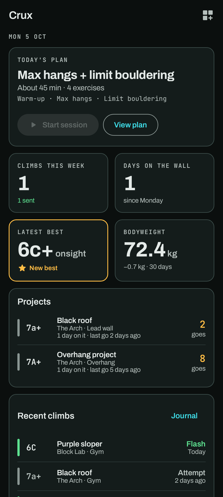</td>
    <td></td>
    <td>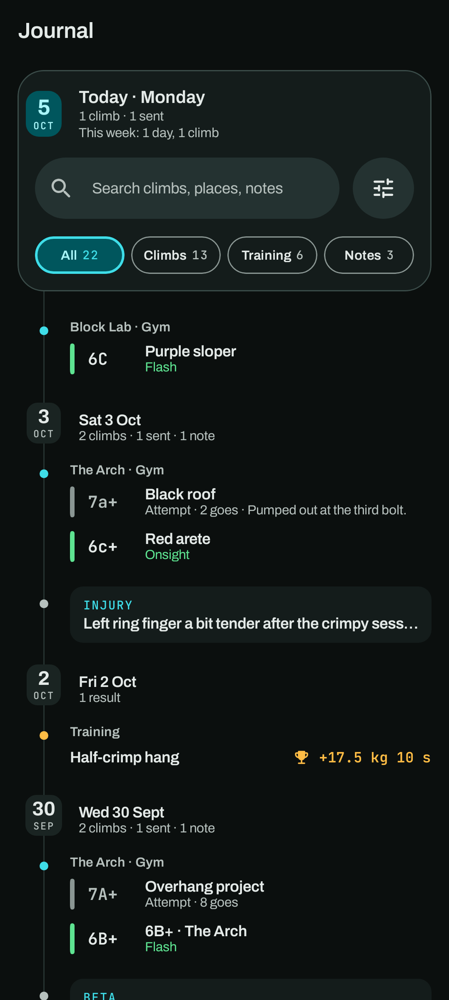</td>
    <td>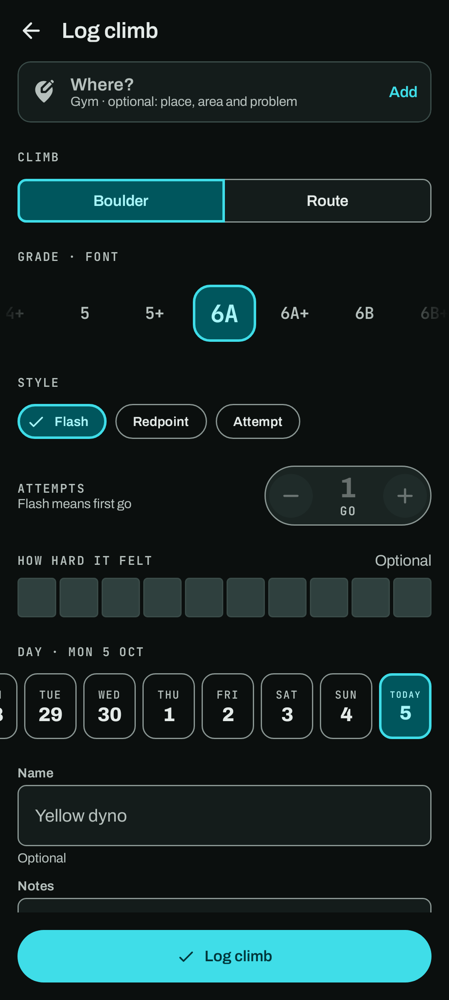</td>
  </tr>
  <tr>
    <td align="center"><b>Home</b><br>your dashboard</td>
    <td align="center"><b>Session</b><br>train live, set by set</td>
    <td align="center"><b>Journal</b><br>every climb, session and note</td>
    <td align="center"><b>Log climb</b><br>grade, style, effort, day</td>
  </tr>
  <tr>
    <td>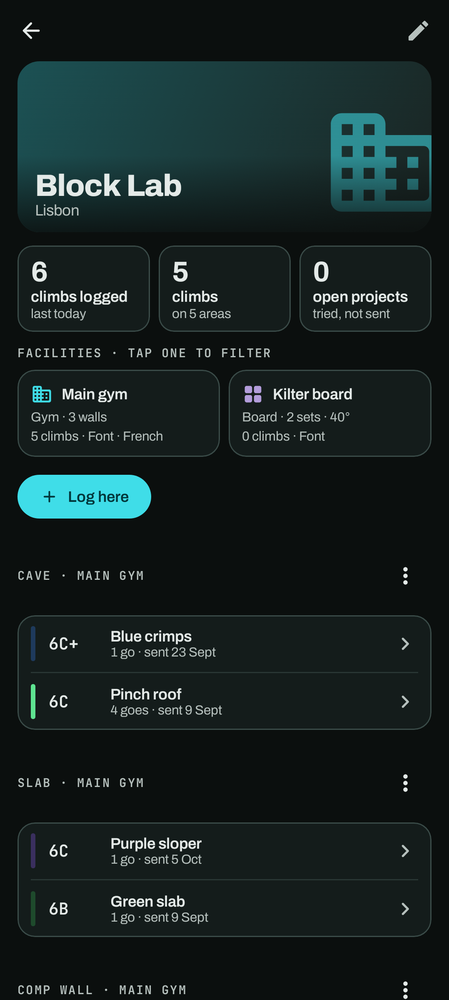</td>
    <td>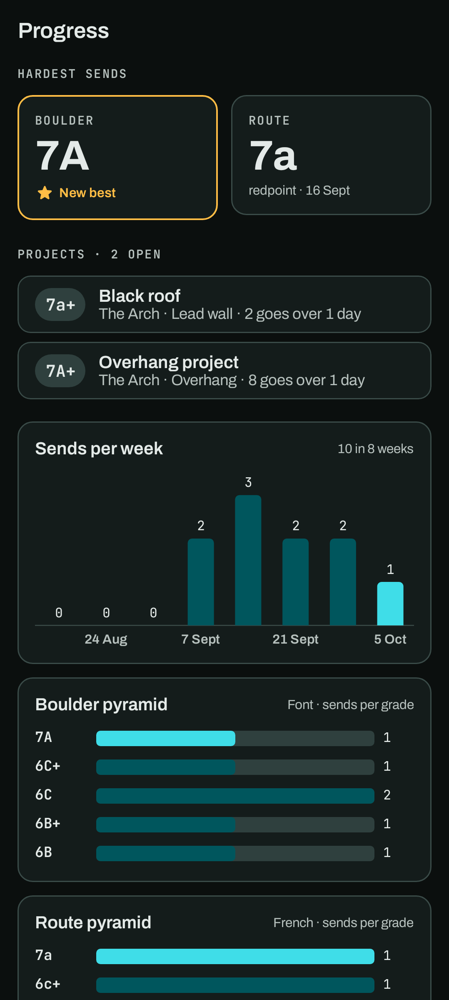</td>
    <td>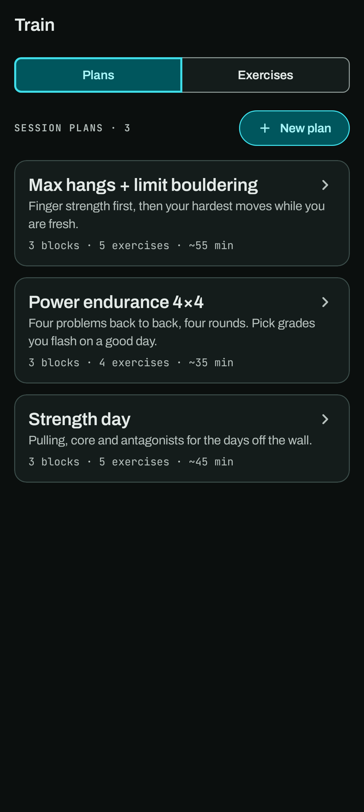</td>
    <td></td>
  </tr>
  <tr>
    <td align="center"><b>Places</b><br>walls, problems, projects</td>
    <td align="center"><b>Progress</b><br>bests, pyramids, charts</td>
    <td align="center"><b>Train</b><br>plans and exercises</td>
    <td align="center"><b>You</b><br>records, consistency, body</td>
  </tr>
</table>

<details>
<summary>Light theme</summary>
<p>
  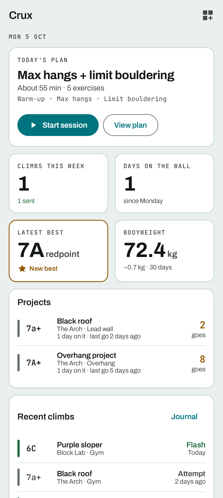
  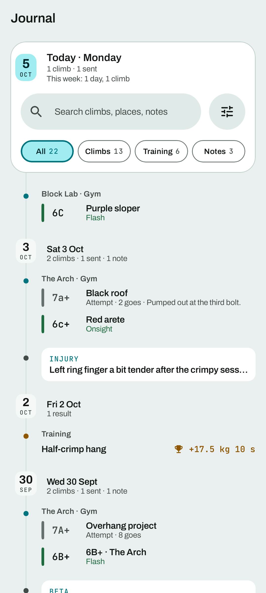
  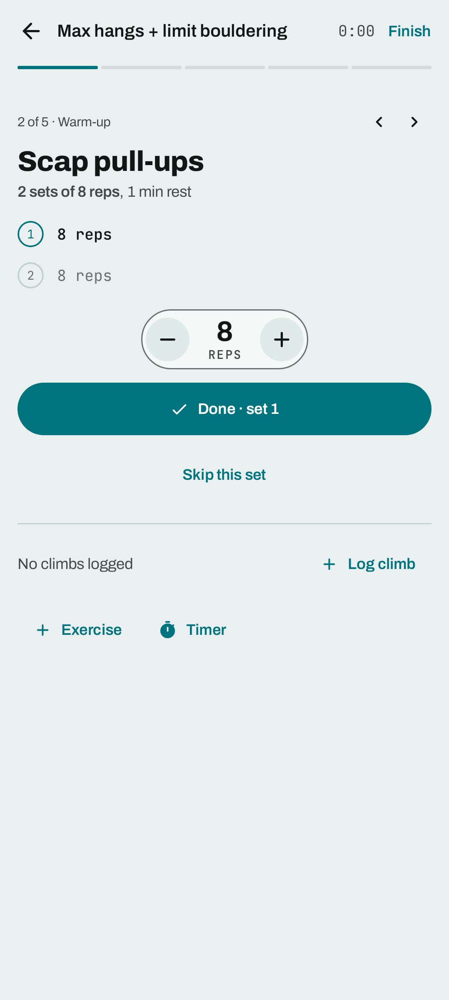
  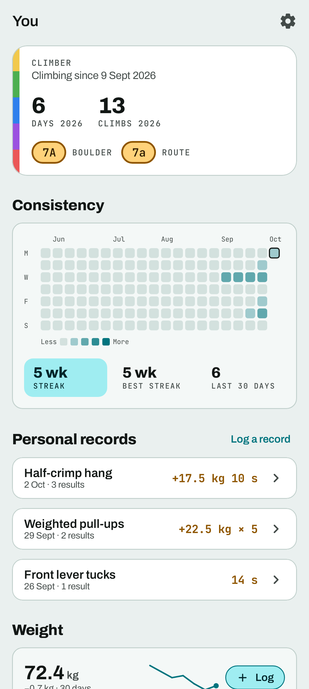
</p>
</details>

Every screenshot is rendered from the app's real screens with the demo data, by the screenshot
tests, so they always match the current version.

## Features

**Train**
- An exercise library measured your way: reps, time, with or without added load, or intervals.
- Session plans in blocks, with targets for sets, reps, time, load and rest.
- **Live sessions**: run a plan set by set with a rest timer, or a climbing day without a plan. An
  interval timer (Tabata, hangboard repeaters, your own) logs each cycle for you.

**Climb**
- Log a climb in seconds: grade, style (flash, onsight, redpoint, attempt), goes, how hard it felt,
  the day, a photo and a video.
- **Places**: gyms, crags and boards with their facilities, walls and problems, an OpenStreetMap
  pin, and the gym's own grades (numbers or colour tapes).
- **Projects** found for you: problems you've tried and not sent yet.
- Font, V, French and YDS grades, **never converted**, plus a grade converter for reference.

**Track**
- **Journal**: one timeline of climbs, sessions, results and notes, with search and filters.
- **Progress**: hardest sends per scale and style, grade pyramids, sends per week and by style.
- **You**: a consistency grid with weekly streaks, personal records, weight, body stats with ape
  index, circumferences, and notes with tags.
- **Home**: a dashboard of widgets you add, resize and arrange.

**Your data**
- Everything on your phone. Backups to a JSON file you keep (photos included); importing only adds.
- Demo mode with sample data, kept apart from yours.
- Metric or imperial, dark or light. Crash reports stay on the phone unless you share them.

See the **[user guide](docs/README.md#user-guide)** for every feature, and
**[use cases](docs/user/use-cases.md)** for how they fit into a climbing week.

## Install

Crux needs **Android 9** or newer.

1. Download `crux-vX.Y.Z.apk` from the [latest release](https://github.com/hardtekpt/crux/releases/latest).
2. Open it on your phone and allow installing from that source when Android asks.

Updates install over the old version and keep your data. Every release is signed with the same key,
whose certificate SHA-256 is:

```
a2:8e:87:81:7c:00:0b:9f:3c:8d:d2:42:98:03:60:5e:2d:78:f7:6e:af:9c:7c:63:56:67:6b:fe:2b:3c:cc:36
```

Check a download against the `.sha256` file next to it, or with
`apksigner verify --print-certs crux-vX.Y.Z.apk`. An **F-Droid** listing is on the way
([details](docs/developer/fdroid.md)).

## Privacy

Everything you enter is stored only on your phone. Crux uses the network for two things, both only
when you use them: map tiles from OpenStreetMap, and address search through your phone's geocoder.
Location is asked for only when you tap *My location* on the map. No analytics, no ads, no
third-party SDKs. See [PRIVACY.md](PRIVACY.md).

## Documentation

| For climbers | For developers |
| --- | --- |
| [Getting started](docs/user/getting-started.md) | [Development setup](docs/developer/setup.md) |
| [Home](docs/user/home.md) · [Training](docs/user/training.md) · [Sessions](docs/user/sessions.md) | [Tech stack](docs/developer/tech-stack.md) · [Architecture](docs/developer/architecture.md) |
| [Journal](docs/user/journal.md) · [Places](docs/user/places.md) · [Progress](docs/user/progress.md) | [Project structure](docs/developer/project-structure.md) · [Data model](docs/developer/data-model.md) |
| [You](docs/user/you.md) · [Grades](docs/user/grades.md) | [Database](docs/developer/database.md) · [Backup format](docs/developer/backup-format.md) |
| [Settings and your data](docs/user/settings-and-data.md) | [UI and design system](docs/developer/ui-and-design-system.md) |
| [Use cases](docs/user/use-cases.md) · [FAQ](docs/user/faq.md) | [Testing](docs/developer/testing.md) · [CI/CD](docs/developer/ci-cd.md) · [Releasing](docs/developer/releasing.md) |

The full index is in [docs/](docs/README.md).

## Built with

Kotlin · Jetpack Compose and Material 3 · Navigation Compose · Hilt · Room · DataStore ·
Coroutines and Flow · kotlinx.serialization · WorkManager · osmdroid (OpenStreetMap). Tested with JUnit,
Robolectric, Roborazzi screenshot tests and instrumented tests on an emulator. Details and
versions are in [Tech stack](docs/developer/tech-stack.md).

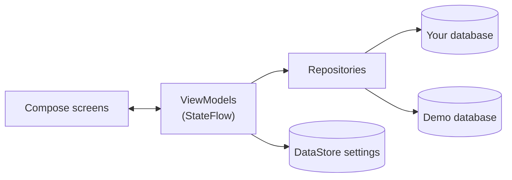

One activity and an MVVM architecture over Room, with two databases (yours and the demo)
behind every repository. See [Architecture](docs/developer/architecture.md).

## Building from source

```sh
git clone https://github.com/hardtekpt/crux.git && cd crux
./gradlew assembleDebug                                 # debug APK
./gradlew spotlessCheck verifyRoborazziDebug lintDebug  # what CI checks
```

You need JDK 21 and the Android SDK (platform 37). On Windows, `.\crux run` builds and launches the
app on an emulator in one step. See [Development setup](docs/developer/setup.md).

## Changelog

**[0.2.0](https://github.com/hardtekpt/crux/releases/tag/v0.2.0)** (2026-10-07):
- **Live sessions** with a rest timer and an interval timer that logs cycles for you.
- **Session summaries** in the Journal.
- **Exercise defaults** and interval timers set on the exercise.
- **Places with several facilities**, each with its own grades, and a new place page.
- **Crash reports** you can share.
- **About** screen.
- Updates never wipe your data.
- Crux is now open source.

**[0.1.0](https://github.com/hardtekpt/crux/releases/tag/v0.1.0)** (2026-10-06): the first release, with
the exercise library and plans, journal, places, progress, profile, dashboard, backups and demo
mode.

The full history is in [CHANGELOG.md](CHANGELOG.md).

## Roadmap

- Session history in backups, and personal records from session sets.
- An F-Droid listing, then Google Play.
- Training reminders.

Ideas and requests are welcome as [issues](https://github.com/hardtekpt/crux/issues/new/choose).

## Contributing

Bug reports, ideas and pull requests are welcome. Read [CONTRIBUTING.md](CONTRIBUTING.md) and the
[Code of Conduct](CODE_OF_CONDUCT.md). If Crux crashes, *Settings → Diagnostics → Crash reports*
lets you share the report to attach to an issue. For security problems, see [SECURITY.md](SECURITY.md).

## License

Copyright (C) 2026 Francisco Santos

Crux is free software: you can redistribute it and/or modify it under the terms of the GNU General
Public License as published by the Free Software Foundation, either version 3 of the License, or
(at your option) any later version. It is distributed in the hope that it will be useful, but
WITHOUT ANY WARRANTY; without even the implied warranty of MERCHANTABILITY or FITNESS FOR A
PARTICULAR PURPOSE. See [LICENSE](LICENSE) for the full text.
