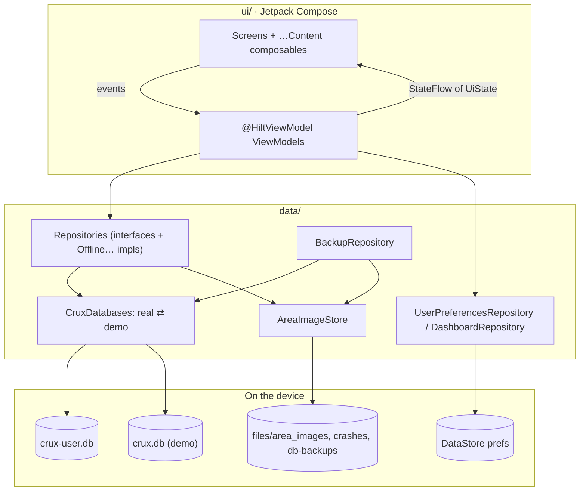
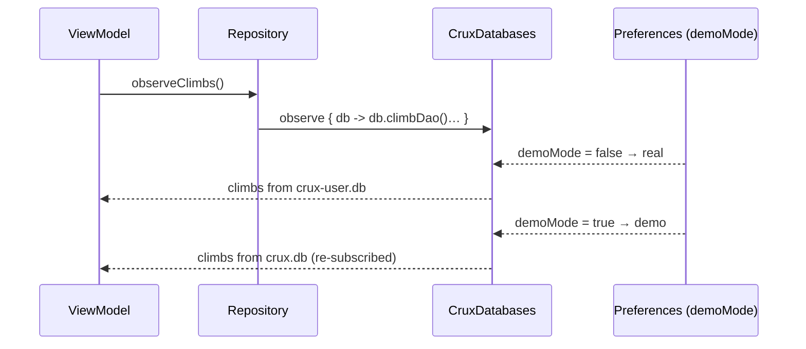

# Architecture

Crux is a single-module Android app. Everything runs on the phone; there is no server, account
or sync.

## Layers

### `ui/`: Compose screens and ViewModels

- One package per area: `home`, `train`, `journal`, `session`, `progress`, `you`, `places`,
  `settings`, `quicklog`. Shared code lives in `components` (the design system's building blocks
  and the touch input kit), `charts`, `navigation` and `theme`.
- A screen is a `@HiltViewModel` plus composables. The ViewModel exposes `StateFlow`s built with
  `combine(…).stateIn(viewModelScope, WhileSubscribed(5_000), initial)`, and plain functions for
  events. Screens collect with `collectAsStateWithLifecycle()`.
- The main tabs have a stateless `…Content(uiState, …)` composable (`HomeContent`,
  `JournalContent`, `ProgressContent`, `YouContent`, `SettingsContent`, `LogClimbContent`) for
  previews and screenshot tests. Other screens take their ViewModel as a parameter (defaulting to
  `hiltViewModel()`), so tests can pass one built by hand.
- **Composition locals** for app-wide context: `LocalUnits` (metric or imperial), `LocalGradeScales`,
  `LocalClock` ("today"; the system clock in the app, a fixed clock in screenshot tests) and
  `LocalNavBarClearance` (room for the floating bar).

### `data/`: repositories over Room and DataStore

- Repositories behind interfaces: `ClimbRepository`, `PlaceRepository`, `BodyRepository`,
  `TemplateRepository`, `ExerciseRepository`, `SessionRepository`, `NoteRepository` and
  `RecordRepository`. Each has an `Offline…` implementation over Room, bound in `di/DataModule.kt`.
  Tests use the fakes in `app/src/test/.../data/Fakes.kt` or the real ones on in-memory Room.
- `model/` holds the domain types (`Climb`, `Place`, `WorkoutTemplate`, `Session`, `GradeScale`,
  and so on). `local/` holds Room entities, DAOs and the database. Repositories map between them.
- Also here:
  - `prefs/`: settings in DataStore.
  - `dashboard/`: the Home layout as JSON in DataStore.
  - `backup/`: the backup file format and import/export.
  - `images/`: copies photos and videos into app storage.
  - `diagnostics/`: on-device crash reports.
  - `seed/`: starter library and demo data.

### `di/` and `work/`

Hilt modules: `DatabaseModule` (how each database is built), `AndroidModule` (application scope,
content resolver, crash reports), `ClockModule` (an injectable `java.time.Clock`, so time is
testable) and `RepositoryModule` (bindings). `work/` holds WorkManager workers. The Hilt worker
factory is set up in `CruxApplication`.

## Two databases: yours and the demo

[`CruxDatabases`](../../app/src/main/java/com/hardtekpt/crux/data/local/CruxDatabases.kt) holds two
Room databases with the same schema:

| Database | File | Used when | On a schema change without a migration |
| --- | --- | --- | --- |
| The climber's own | `crux-user.db` | Normally | Opening fails loudly. The file is copied to `files/db-backups/` before any migration. It is **never wiped**. |
| Demo | `crux.db` | *Settings → Demo mode* | Rebuilt and seeded again |

Repositories never hold a database. They read with `dbs.observe { db -> … }`, a flow that switches to
the other database when demo mode changes (`flatMapLatest`), and write with `dbs.current()`.

## Navigation

Navigation Compose with type-safe `@Serializable` routes
([Routes.kt](../../app/src/main/java/com/hardtekpt/crux/ui/navigation/Routes.kt)), wired in
[`CruxApp.kt`](../../app/src/main/java/com/hardtekpt/crux/ui/CruxApp.kt). Each bottom-bar tab is a
nested graph (`HomeGraph`, `TrainGraph`, `JournalGraph`, `ProgressGraph`, `YouGraph`), so every tab
keeps its own back stack. Places, Settings and About live in the You graph. The floating bar's **+**
opens the quick-log sheet over any tab. Transitions are quiet fades, and a running session shows as
a pill above the bar.

## Live sessions

A session is a row in `sessions` with status `RUNNING`, `FINISHED` or `DISCARDED`. Starting from a
plan copies the plan's exercises and targets into `session_items`, so later edits to the plan don't
rewrite history. Each logged or skipped set is a `session_sets` row. Climbs logged while a session
runs carry its `sessionId`. Only one session runs at a time.

The interval and rest timers are computed from the clock (start time plus pause bookkeeping), not
ticked, so they stay right when the screen is off or the app is in the background.

## Domain decisions worth knowing

- **Grades** are a scale (`GradeScale`: Font, V, French, YDS, or a local scale) plus an index, and
  they're **never converted**. Local grades also store the label or tape colour. Bests are per
  scale, and for local scales per place. The grade converter (`GradeConversion`) is a reference
  tool only.
- **Places → sections → areas.** A place has one or more sections (facilities: gym, crag or
  board), each with its own grade scales. Walls (areas) hang off sections.
- **Climbs and logs** (schema 21). A *climb* (a `problems` row, `Problem` in code) is what's tried:
  name, discipline, grade, and optionally a place, section and wall. A *log* (a `climbs` row,
  `Climb` in code) is one day's goes on it: `attempts`, `sends`, the `style` worked out from them,
  effort, notes, media, session. Every log has a climb: `ClimbLinks.linkUnlinked` gives a log
  without one the climb of the same name at the same place (and discipline), or a new climb, named
  from the grade and where it was when the log has no name. Editing a climb rewrites its logs'
  name, grade and place (`PlaceDao.syncLogs`); deleting the last log deletes the climb. A climb has
  no page of its own: opening it opens Log climb with `problemId`, which lists its other logs.
- **Projects are derived, not flagged**: a climb that isn't taken down, has goes, and has no send.
- **Retired** (shown as *taken down*): hidden from suggestions and projects, history kept.
  Resetting a wall takes its climbs down.
- **Units**: stored in kg and cm. Imperial only changes what's shown.
- **Media**: photos are scaled to 2048 px JPEGs in `files/area_images`, and videos are copied as
  they are. The database stores only file names.
- **Time**: business logic takes an injected `Clock`, and UI reads `LocalClock`, never
  `LocalDate.now()` directly.

## Backups

See [Backup format](backup-format.md). In short: a zip archive with a self-describing JSON file of
optional sections, and the photos and videos it names. Records refer to each other by name, never
database id. Records already on the phone are listed first, and the climber decides each one.

## Reliability

- The climber's database is copied before every migration ([`DatabaseSnapshots`](../../app/src/main/java/com/hardtekpt/crux/data/local/DatabaseSnapshots.kt)),
  inside Room's open-helper factory, off the main thread.
- Uncaught exceptions are written to `files/crashes/` ([`CrashReports`](../../app/src/main/java/com/hardtekpt/crux/data/diagnostics/CrashReports.kt))
  and handed on. Nothing leaves the device unless the climber shares a report.
- Android Auto Backup carries the climber's database and preferences only
  ([`data_extraction_rules.xml`](../../app/src/main/res/xml/data_extraction_rules.xml)).

See also: [Project structure](project-structure.md) · [Data model](data-model.md) ·
[UI and design system](ui-and-design-system.md) · [Testing](testing.md)
