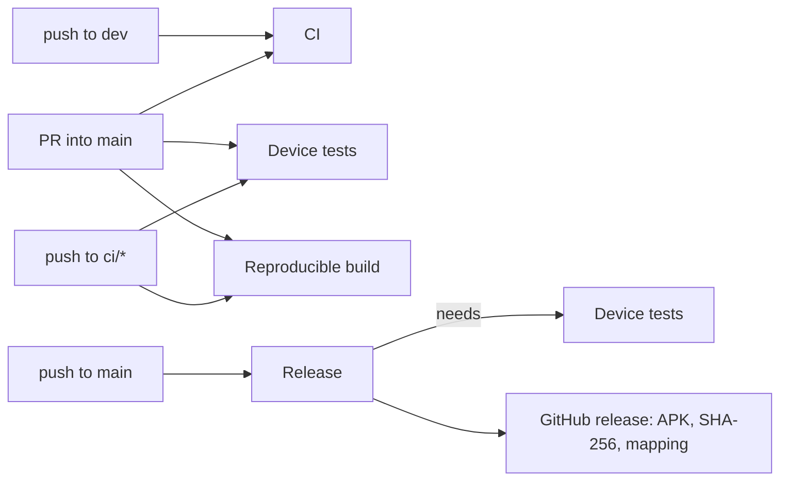

# CI/CD

GitHub Actions, in [`.github/workflows/`](../../.github/workflows).

## Workflows

| Workflow | Triggers | What it does |
| --- | --- | --- |
| **CI** (`ci.yml`) | Push to `dev`, PRs into `main` | `spotlessCheck verifyRoborazziDebug lintDebug koverXmlReportDebug`, then `assembleRelease` (debug-signed). Uploads coverage, and test/lint/screenshot reports on failure. A newer push cancels the running one. |
| **Device tests** (`device-tests.yml`) | PRs into `main`, pushes to `ci/**`, manual, and called by Release | Emulator (API 35, Pixel 6 profile, 4 GB disk, 2 GB RAM, KVM): `connectedDebugAndroidTest`, then installs the minified release APK and checks it launches and stays up. |
| **Reproducible build** (`reproducible.yml`) | PRs into `main`, pushes to `ci/**`, manual | Builds the release APK twice from clean checkouts and compares them with `apksigcopier`. |
| **Release** (`release.yml`) | Push to `main`, manual | After Device tests pass: ktlint, unit, screenshot and lint checks; signed release build; certificate check against `CRUX_CERT_SHA256`; publishes the GitHub release. See [Releasing](releasing.md). |

**Dependabot** opens grouped weekly PRs into `dev` for Gradle (AndroidX/Compose, Kotlin, tooling,
testing) and GitHub Actions updates.

## Secrets

Only the Release workflow uses secrets, and it runs only on `main`. PRs from forks never see them.

| Secret | What |
| --- | --- |
| `CRUX_KEYSTORE_BASE64` | The release keystore, base64-encoded |
| `CRUX_KEYSTORE_PASSWORD`, `CRUX_KEY_ALIAS`, `CRUX_KEY_PASSWORD` | Its passwords and alias |

Without them, release builds fall back to the debug key, which is fine for CI's own builds and
never published.

## Gotchas

- **Runners are slow.** Tests must not depend on wall-clock timing (see [Testing](testing.md)).
- **The emulator needs room.** Device tests free disk space, stop the Gradle and Kotlin daemons
  before booting the emulator, and use a Pixel-sized profile (the default AVD is 320×640).
- **`workflow_dispatch`** only works for workflows on `main`. To run device tests on another branch,
  push to `ci/<anything>`.
