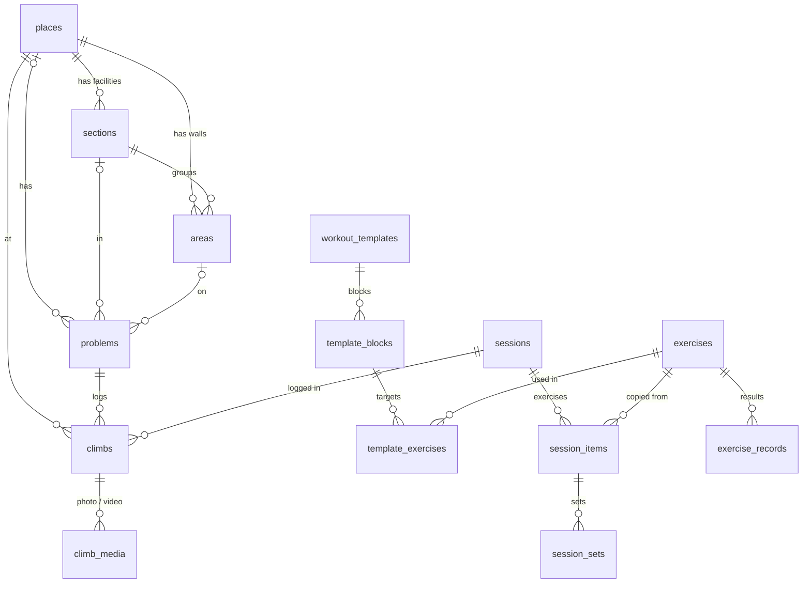

# Data model

Room database [`CruxDatabase`](../../app/src/main/java/com/hardtekpt/crux/data/local/CruxDatabase.kt),
**schema 21** at the time of writing. The exported schemas live in
[`app/schemas/`](../../app/schemas/com.hardtekpt.crux.data.local.CruxDatabase); each version's JSON
is the source of truth for its tables. To change the schema, see [Database](database.md).

## Entities

| Table | Holds | Key columns |
| --- | --- | --- |
| `climbs` | Logs: a day's goes on a climb | `problemId` (its climb; set on every log since schema 21), `discipline`, `gradeScale` + `gradeIndex` (+ `gradeLabel`/`gradeColour` for local grades), `style` (worked out from the goes), `attempts`, `sends`, `venue`, `dateEpochDay`, `name` (the climb's), optional `placeId`/`sectionId`/`areaId`, `angle`, `effort`, `sessionId` |
| `climb_media` | A climb's photo and video | `climbId`, `kind` (`IMAGE`/`VIDEO`), `path` (a file name in `files/area_images`) |
| `places` | Gyms, crags, boards | `name`, `type` (main kind), `extraTypes`, `favourite`, `latitude`/`longitude`/`address`, legacy place-wide scales |
| `sections` | A place's facilities | `placeId`, `type` (`GYM`/`CRAG`/`BOARD`), `name`, `position`, `boulderScale`/`routeScale`/`localScale` |
| `areas` | Walls and boards | `placeId`, `sectionId`, `name`, `angle`, `resetEpochDay`, `imagePath` |
| `problems` | Climbs: what's tried, by name and grade | optional `placeId`/`sectionId`/`areaId`, `name`, `discipline`, grade, `tape`, `setEpochDay`, `retired` (taken down) |
| `exercises` | The exercise library | `name`, `category`, `metric`, defaults (`defaultSets`…`defaultRepRestSeconds`, `prepSeconds`) |
| `workout_templates` | Session plans | `name`, `description`, `position` |
| `template_blocks` | A plan's blocks | `templateId`, `position`, `name` |
| `template_exercises` | An exercise's target in a block | `blockId`, `exerciseId`, `sets`, `reps`, `seconds`, `loadKg`, `restSeconds`, `repRestSeconds` |
| `sessions` | Live and finished sessions | `templateId`, `placeId`, `sectionId`, `startedAtMillis`, `endedAtMillis`, `status` (`RUNNING`/`FINISHED`/`DISCARDED`), `effort`, `notes` |
| `session_items` | A session's exercises (copied from the plan) | `sessionId`, `exerciseId`, `blockName`, target columns |
| `session_sets` | What was done | `itemId`, `setIndex`, `reps`, `seconds`, `loadKg`, `skipped`, `completedAtMillis` |
| `body_measurements` | Weight, body stats, circumferences | `type` (`MeasurementType`), `value` (kg/cm), `dateEpochDay` |
| `exercise_records` | Results for personal records | `exerciseId`, `dateEpochDay`, `reps`, `seconds`, `loadKg`, `notes` |
| `notes` | Free notes | `text`, `pinned`, `tag` (lower case) |

## Conventions

- **Dates** are `dateEpochDay` (local days). **Instants** are `…AtMillis`.
- **Units** are always metric (kg, cm). Imperial is display-only.
- **Enums** are stored by name. Renaming an enum entry needs a data migration.
- **Grades** are scale + index, plus label and colour for local grades. They're never converted.
- **Derived data isn't stored**: projects, personal bests, personal records, streaks and climb
  stats are computed in SQL or in repositories from the rows above.
- **Media** rows store file names only. The files live in `files/area_images`.

## Other storage

| Where | What |
| --- | --- |
| DataStore `files/datastore/user_prefs.preferences_pb` | Grade scales, theme, units, timer, demo mode, demo data version, Home dashboard layout (JSON), backup photo and video switches |
| `files/area_images/` | Photos (JPEG, at most 2048 px) and videos |
| `files/crashes/` | Crash reports (newest 10) |
| `files/db-backups/` | Copies of `crux-user.db` taken before migrations (newest 3) |
| `databases/crux.db` | The demo database (same schema) |
