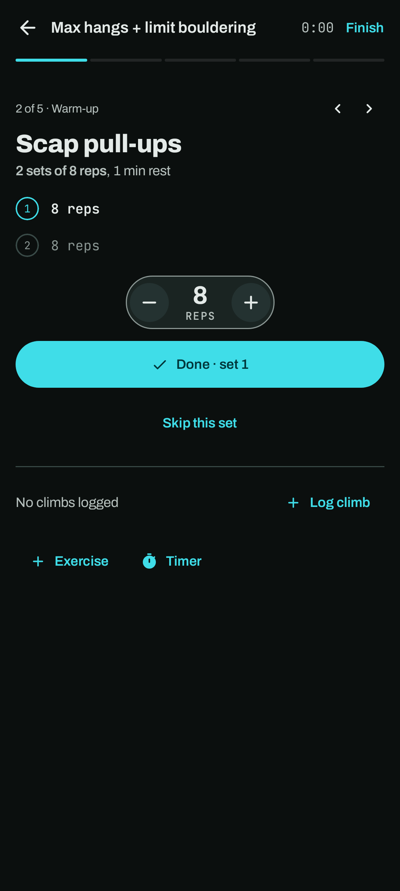

# Sessions

A session is a workout you log as you go: either one of your plans, set by set, or a climbing day
without a plan, where you log climbs.

## Starting a session

- From the **+** Log menu, choose **Start a session**, then pick a plan or *no plan* for a
  climbing day.
- From a plan's page, or the **Today's plan** widget on Home, tap **Start session**.

Crux starts the session at the last place you climbed, and you can change that inside the
session. Only one session runs at a time; starting another ends the first.

## While it runs

- The top bar shows the session's name, a quiet clock and **Finish**. Below it, a progress strip
  has one segment per exercise; tap a segment to jump to that exercise.
- **One exercise at a time**: its place in the plan, its goal as a sentence (for example
  "6 hangs of 10 s with +17.5 kg, 3 min rest"), and a row per set.
- **Logging a set**: the next set starts at the target, or at what your last set was. Change what
  went differently, then tap **Done**. *Skip this set* marks it skipped. Tap a logged set to change
  it or take it out.
- **Rest timer**: after a set, a band opens with the rest counting down, with **+30 s** and
  **Skip**. It beeps for the last three seconds and buzzes when the rest is over. After the last
  set, Crux moves on to the next exercise.
- **Interval timer**: interval exercises run a timer with preparation, work and rest phases, the
  repeats and cycles left, and pause, play and stop. Each finished cycle is logged as a set. You
  can also log cycles by hand.
- **Extras**: **+ Exercise** adds an exercise from your library, and **Timer** runs an interval
  timer of its own. Presets include classic Tabata (8 × 20 s on, 10 s off) and hangboard repeaters
  (6 × 7 s on, 3 s off, three cycles, 3 min between).
- **Climbs**: **Log climb** inside a session adds the climb to the session and to your journal. The
  session shows your climbs, sends and hardest send so far. Several logs on the same climb show
  as one entry with the goes added up (a redpoint once one of them is a send), here, in the
  Journal and in the session's summary.

The arrows at the end of the band make it **compact**: one slim line with the number, what's left
and the controls, so more of the exercise shows. Tap them again for the large band. Crux remembers
which you chose.

The screen stays on while something counts down. Timers are worked out from the clock, so they stay
right if the screen turns off or you switch apps.

**Leaving** with the back arrow keeps the session running. A pill above the bottom bar shows its
name and clock; tap it to go back.

## Finishing

Tap **Finish**. Add how hard it felt (1–10) and a note, then save. Or throw the session away. Crux
asks first, and climbs you logged in it stay in the journal.

Finished sessions appear in the [Journal](journal.md) with their length. Tap one for its
summary: when, where and for how long, how it felt, what got done against the plan, every set of
every exercise, the climbs and your note.

Session history is in backups, with every set, and the climbs logged in a session stay linked to it
when you restore.
