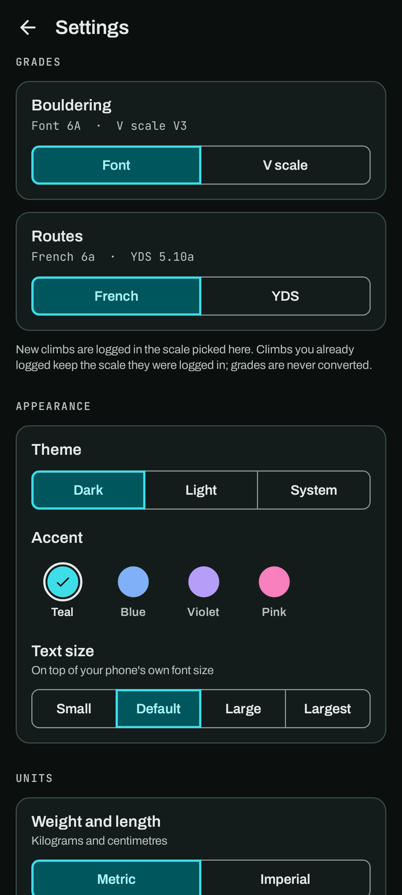
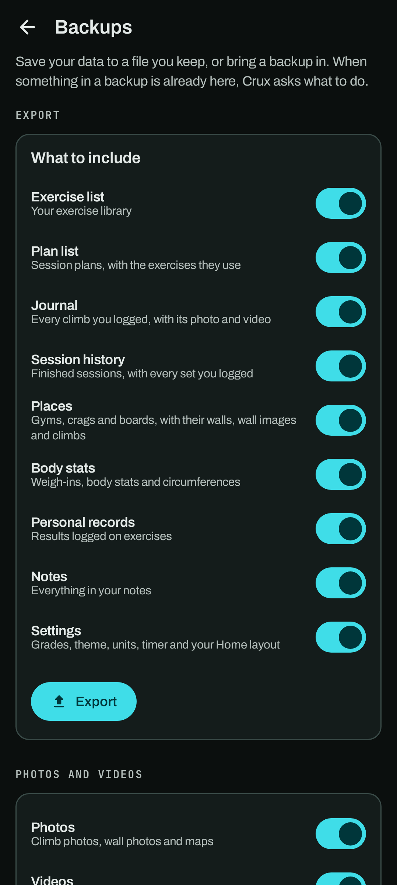

# Settings and your data

Open Settings from the gear on the **You** tab.

## Settings

- **Grades**: the scale new climbs are logged in, per discipline. See [Grades](grades.md).
- **Appearance**: Dark (the default), Light, or System, and the accent colour: Teal (the
  default), Blue, Violet or Pink. The accent colours buttons, selected options and highlights;
  the amber for goes and the green for sends stay the same in every accent. **Text size** makes
  the text in Crux smaller or larger (Small, Default, Large, Largest) on top of your phone's own
  font size. Crux reopens on the same page to apply it.
- **Units**: Metric (kilograms and centimetres) or Imperial (pounds, feet and inches). Everything is
  stored metric, and Imperial only changes what you see, so switching back and forth loses nothing.
- **Your data**: demo mode, and *Backups*, a page of its own.
- **Diagnostics**: crash reports.
- **About**: version, licence, source code, and the open-source libraries Crux uses.

## Demo mode

Demo mode shows a separate set of sample data: places, climbs, plans, weigh-ins, body stats,
records and notes. It's a separate database. Anything you do in demo mode stays there, and your own data is
untouched until you turn demo mode off.

## Backups

*Settings → Backups* saves your data to a file you keep, and brings a backup back in.

- **Export**: choose sections (exercise list, plan list, journal, session history, places, body
  stats, personal records, notes, settings), then pick where to save the `.zip` file: your phone,
  a cloud drive, anywhere your file picker offers.
- **Import**: pick a backup file. Crux shows what's in it, and you choose what to bring in.
  *Settings* starts switched off, because importing them replaces your grades, theme, units, timer
  and Home layout.

**When something in the backup is already in Crux**, Crux asks about each one before importing
anything. It shows what's in Crux and what's in the backup, and says when they're the same. For
each one you choose:

- **Skip**: keep what's in Crux.
- **Replace**: use the backup's version. A place keeps its own walls and climbs, and the backup's
  are updated or added by name.
- **Keep both**: add the backup's as a copy. A named copy gets a number, like "Max hangs (2)".

Tick *Do the same for the other …* to answer once for the rest of that section, such as every
climb. *Cancel import* stops before anything changes. Exercises, plans and places count as already
here when they have the same name; climbs, sessions, notes, records and body stats when they were
logged at the same moment.

**Photos and videos** go into the backup unless you switch them off under *Photos and videos* on the
Backups page. The switches apply to imports too: with videos off, a backup's videos are left out.
Videos can make a backup large.

Backups from older versions of Crux keep importing into newer ones, the `.json` files they made
included. A backup from a *newer* version than the app is refused, with a message to update the
app first.

## Android's own backup

If Android backup is on for your phone, Crux's database and settings are included in it, so a
new phone set up from your Google account backup gets them back. Photos and videos are left out of
the cloud backup (it has a 25 MB limit) and travel only with a direct phone-to-phone transfer.
The demo data is never backed up.

## Your data is never wiped by an update

When an update changes how data is stored, Crux first saves a copy of your database on the phone,
then upgrades it. Updates never delete your data to start over.

## Crash reports

If Crux closes unexpectedly, a report is saved **on your phone only**: the app version, Android
version, phone model and the error. *Settings → Diagnostics → Crash reports* shows how many there
are and lets you **share the latest** (to paste into a bug report) or **clear** them. Nothing is
sent anywhere unless you share it yourself.

## Privacy

No account, no ads, no analytics, no tracking. The network is used only for map tiles and address
search, when you use them. See [PRIVACY.md](../../PRIVACY.md).
