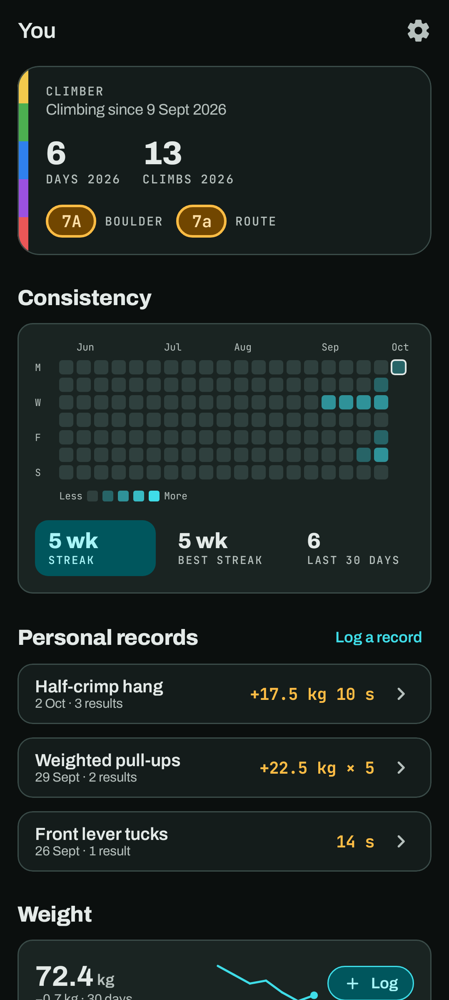
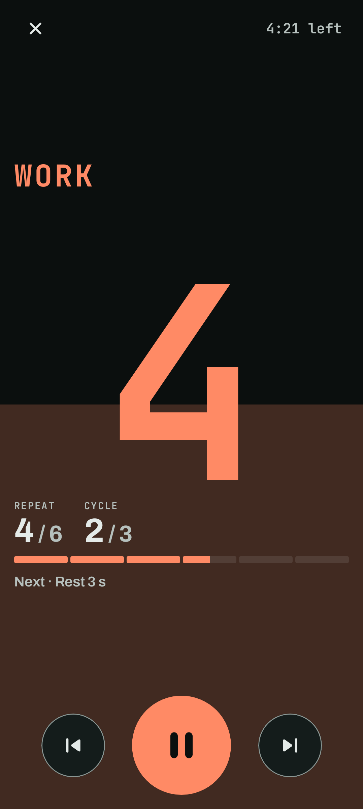

# You

The **You** tab is your climber profile. The gear at the top right opens [Settings](settings-and-data.md).

## Climber card

Days on the wall and climbs this year, plus your hardest boulder and route. The coloured strip down
the side is a nod to gym tape.

## Consistency

A grid of the last months, one square per day, darker the more you did that day (climbs and logged
results). Below it are your current **weekly streak** (weeks in a row with at least one day),
your **best streak**, and how many days you were active in the **last 30 days**.

## Personal records

**Log a result** on an exercise: reps, time and/or added load, the day, and a note. For each
exercise, the best result is the **personal record**: the heaviest load, then the most reps, or the
longest hold for timed exercises. Tap an exercise to see its history, and to delete a result.

Results you log in a [session](sessions.md) don't count towards records yet.

## Weight

Your latest weigh-in, a sparkline of the trend, and **Log** for a new one (also in the **+**
menu). Weight is stored in kilograms and shown in pounds under Imperial.

## More about you

A menu of pages:

- **Measurements**: body stats on a body outline you tap to update: height, wingspan (with your
  **ape index**), standing reach, weight and body fat. Below them are a weight chart (1M, 3M, 1Y or
  all) and every weigh-in.
- **Circumferences**: forearm, bicep and thigh (left and right), chest and waist.
- **Notes**: all your notes, pinned first, with tag filters. Tap one to edit, pin, tag or delete it.
- **Places**: your gyms, crags and boards. See [Places](places.md).
- **Grade converter**: pick a system and a grade, and see it in every other system (French, YDS,
  UIAA, British, Ewbank, Font and V), with the whole chart below. It's a reference only; your logged climbs are never converted. See
  [Grades](grades.md#the-grade-converter).
- **Interval timer**: a timer of its own, for the gym. See [below](#interval-timer).
- **Settings**.

Each measurement keeps its history: setting a new value adds today's reading and keeps the old ones.

## Interval timer

*You → Interval timer* is a timer for hangboarding, circuits and 4×4s, with nothing logged. Pick a
preset (**Tabata**, **Repeaters**, **Max hangs**, **4×4s**) or set preparation, work, rest,
repeats, cycles and the rest between cycles yourself. The bar at the top shows the whole timer, each
phase in its colour, and Crux remembers the setup for next time.

**Start** fills the screen. The phase's colour (warm for work, cool for rest) fills it from the
bottom and drains as the phase runs. The seconds left are as big as the screen allows, with the
repeat and cycle you're on and what comes next. Hold the phone on its side and the number moves to
the left, the buttons to the right.

- **Pause** with the big middle button, or tap the number. Paused, **Restart** starts over.
- **⏭** skips to the next phase. **⏮** goes back to the start of this one, or to the one before
  in its first two seconds.
- **✕** or back stops it. Back pauses a running timer first, so a stray swipe doesn't end it.

The last three seconds of each phase beep (if *Timer sounds* is on in Settings), the phone buzzes
when a phase changes, and the screen stays on until you close the timer.
